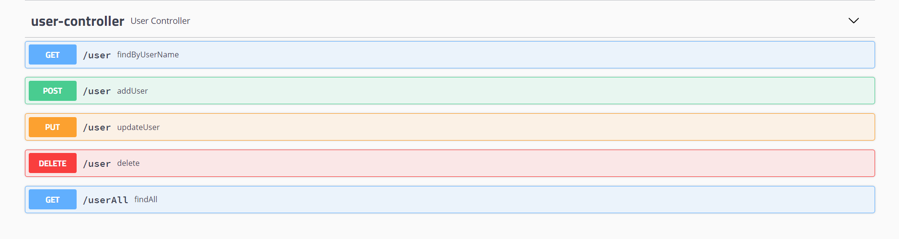

# crudDemo-backend

基于SpringBoot与Vue的前后端分离增删改查小Demo-Spring Boot 后端

src/main/resources/application.yml 修改数据库配置

src/main/resources/crud_demo.sql 数据库建表语句

## Version1

mysql+mybatis+SpringBoot+Swagger

Api

